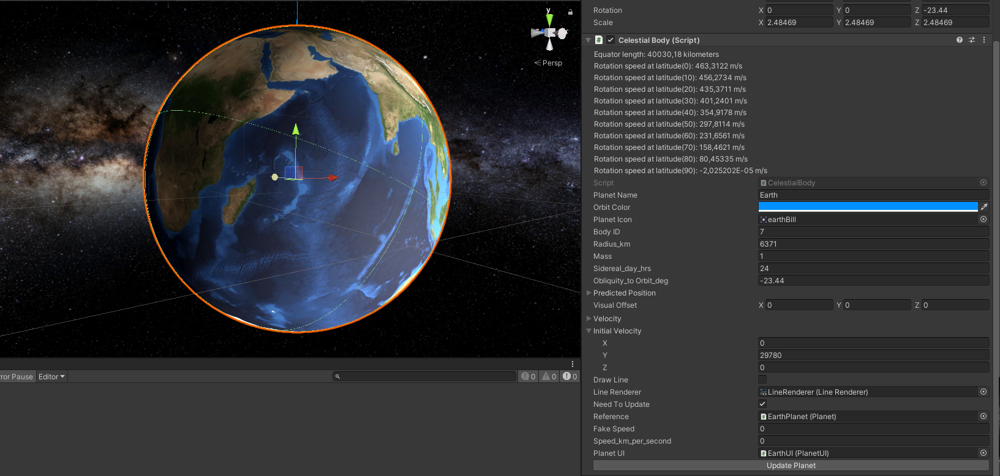
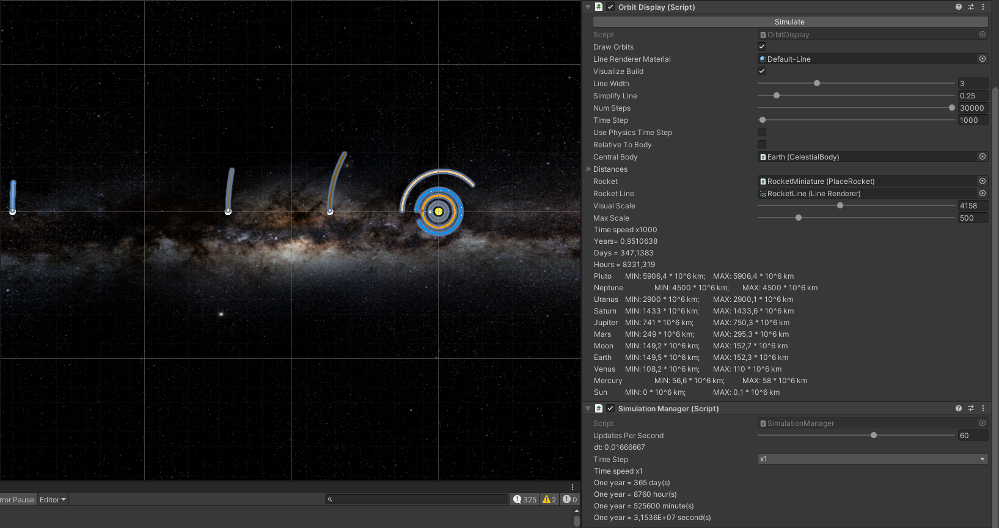
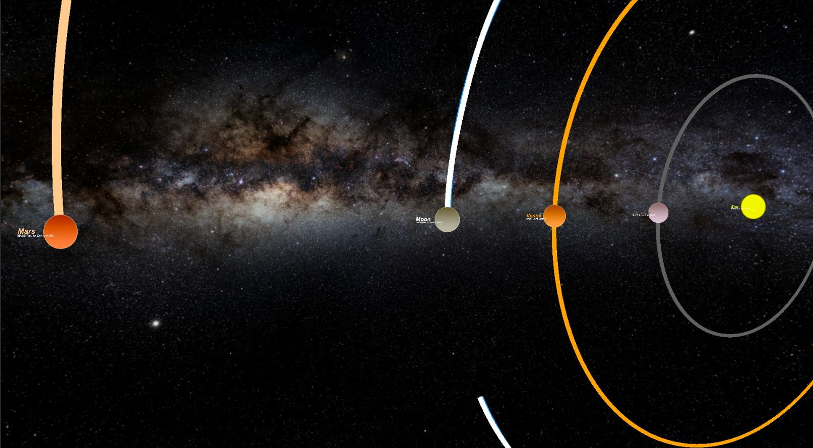
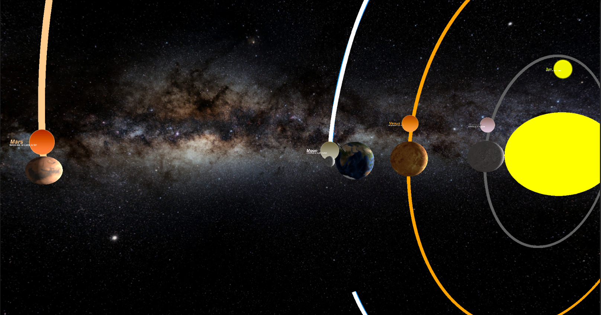
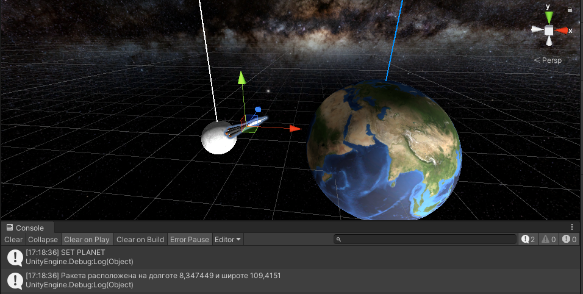
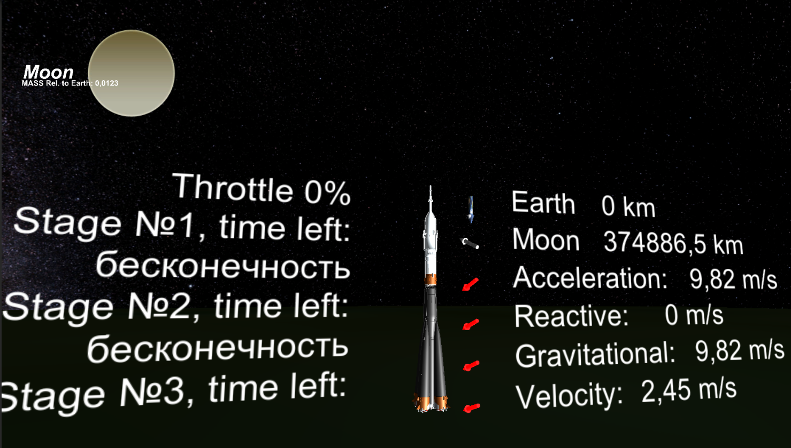
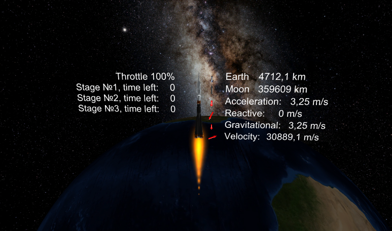
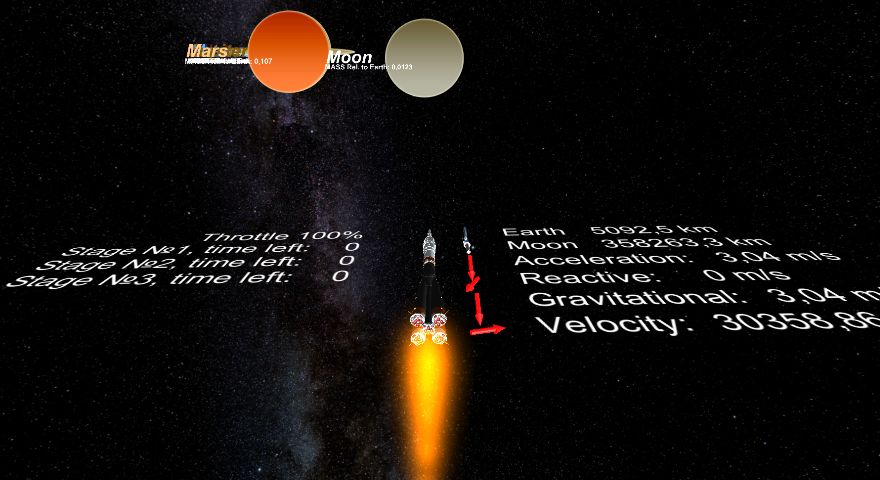

# Celestials-Rocket
Celestial bodies, solar system, rocket on Unity3D

## Celestial Bodies ##

При помощи "инспектора" можно задать исходные данные планеты. 
После данных необходимо нажать кнопку "Update Planet" и для планеты автоматически зададутся настройки, 
необходимые связи и элементы интерфейса.

|  |  |
|------------------------------------|--------------------------------------|
|||
-----------------------------------------------------------------------------

Есть возможность построения орбит относительно других планет.

|

Расположить ракету можно в редакторе Unity3D, для этого нужно выбрать "RocketMiniature" и просто «клинкнуть» на планету

## Rocket ##

## CONTROLS ##
* W изменить направление ракеты
* Arrow UP/DOWN увеличить/уменьшить подачу топлива
* H показать графики

## SPECIAL THANKS TO ##
[XCharts](https://github.com/monitor1394/unity-ugui-XCharts) 
